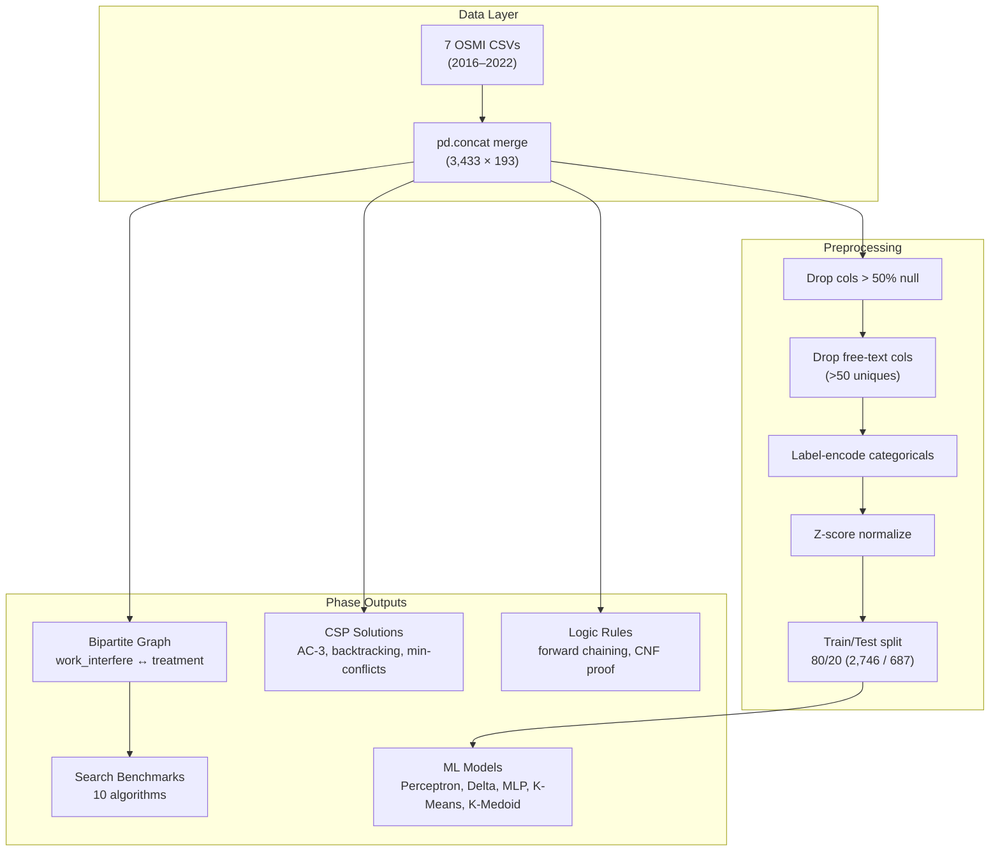
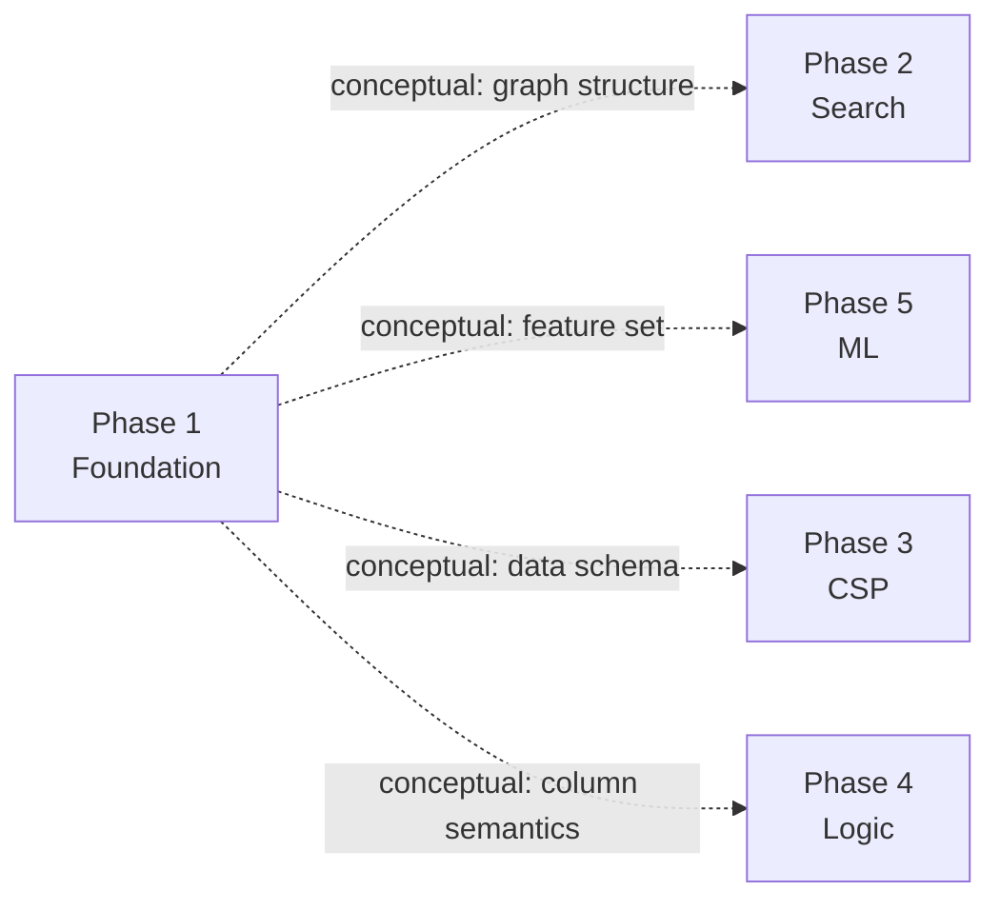

# Architecture

System design documentation for MindSight.

---

## Pipeline Overview

MindSight is a five-phase sequential pipeline. Each phase is a standard Jupyter notebook executed in-process by the master runner.



---

## Data Flow

```
CSV files (raw)
    │
    ▼
pd.concat ──────────────────────────┐
    │                               │
    ▼                               ▼
Column pruning              Bipartite graph construction
    │                               │
    ▼                               ▼
Label encoding              Phase 2: Search algorithms
    │                               │
    ▼                               ▼
Z-score normalization       Phase 3: CSP modeling
    │                               │
    ▼                               ▼
Train/Test split            Phase 4: Propositional logic
    │
    ▼
Phase 5: ML models
    │
    ▼
Comparison table (stdout)
```

---

## Module Responsibility Matrix

| Module | Responsibility | Input | Output |
|:---|:---|:---|:---|
| `phase1_foundation.ipynb` | Data loading, EDA, graph construction | 7 CSVs | Loaded data |
| `phase2_search.ipynb` | 10 search algorithm implementations | Bipartite graph (rebuilt from CSVs) | Search benchmarks |
| `phase3_csp.ipynb` | CSP variables, AC-3, backtracking, min-conflicts | Survey data (rebuilt from CSVs) | CSP Solutions |
| `phase4_logic.ipynb` | Propositional rules, forward chaining, CNF | Survey data (rebuilt from CSVs) | Logic derivations |
| `phase5_ml.ipynb` | 5 ML model implementations + comparison | Survey data (rebuilt from CSVs) | ML Models |
| `scripts/run_all.py` | Pipeline orchestration | All notebooks | All notebooks (executed) |
| `scripts/check_outputs.py` | Output verification | Executed notebooks | Pass/fail report |

---

## Phase Dependency Graph



**Note:** Dependencies are conceptual, not code-level imports. Each phase rebuilds its own data from the raw CSVs independently. This is intentional: it allows any phase to execute in isolation without requiring Phase 1 to have run first, at the cost of duplicated loading logic.

---

## Preprocessing Stages (Column Counts)

| Stage | Columns | Rows | Operation |
|:---|---:|---:|:---|
| Raw merge | 193 | 3,433 | `pd.concat` across 7 CSVs |
| Drop sparse | ~40 | 3,433 | Remove columns with > 50% null values |
| Drop text | ~19 | 3,433 | Remove columns with > 50 unique values |
| Drop null target | 19 | 3,433 | Remove rows where `treatment` is null |
| After encoding | 19 | 3,433 | All columns now numeric (label-encoded) |
| After split | 18 features | 2,746 train / 687 test | `treatment` separated as target |

---

## Windows Compatibility

The pipeline uses Jupyter's `ExecutePreprocessor` which depends on Tornado + ZMQ for IPC. On Windows, Python 3.10+ defaults to `ProactorEventLoop`, which is incompatible with ZMQ socket operations.

`scripts/run_all.py` sets the event loop policy at startup:

```python
if sys.platform == 'win32':
    asyncio.set_event_loop_policy(asyncio.WindowsSelectorEventLoopPolicy())
```

This line must execute before any `nbconvert` import or execution call.
